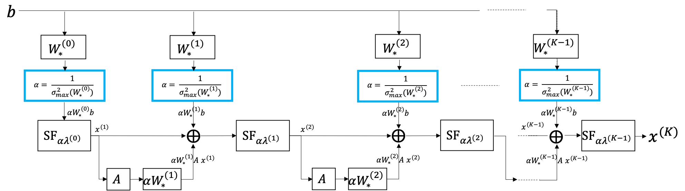
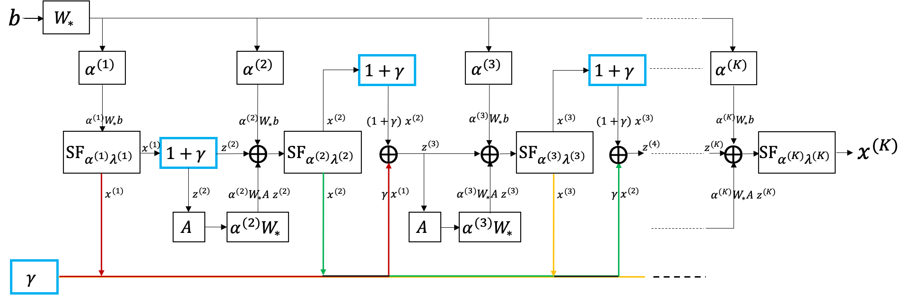

# Research on Sparse Coding-based Face Recognition under Complex Environment

[English](Adaptive Accelerations for Learning-based Sparse Coding.pdf) | [中文](Research on Sparse Coding-based Face Recognition under Complex Environment.pdf)

+ Proposed 2 strategies for learned ISTA to improve the efficiency of image restoration.
+ Apply improved unrolled ISTA in sparse representation-based face recognition. 

## A short Abstract

Sparse coding is an important paradigm to represent visual information, however, many representation-based recognition tasks are still limited by sparse solvers due to their effective computational cost. In this paper, we study data-driven learning for iterative algorithms to accelerate the approximation of sparse solutions. We propose a strategy for sparse dictionary learning combined with automatic tuning of step sizes in the iterative soft thresholding algorithm (ISTA) via its unfolding into a computational graph. In order to make it practical in large-scale applications, we suggest learning the step sizes instead of tuning them. Furthermore, following the assumption of the existence of a data-dependent "optimum" in the acceleration technique implemented in the fast iterative soft thresholding algorithm (FISTA), we introduce a learned momentum scheme to achieve "optimal" gain. Extensive encoding and decoding results confirm our hypothesis and prove the effectiveness of our method.

## Proposed tuned steps LISTA

## Proposed learned steps LISTA

## Proposed "learned momentum" FISTA

## conclusion
The purpose of this paper was to find a lightweight way for trainable sparse coding to speed-up the approximation of "ground truth" sparse solutions. We reaffirmed the importance of step size in learned ISTA with the ideas of step size tuning and step size learning, then experimentally demonstrated the hypothesis of finding a data-dependent "optimal" scalar for the "momentum" of learned ISTA, achieving great performances in our simulation experiments as well as reducing consumption of computational resources. We showed that our schemes are also suited for classification applications such as representation-based face recognition. Future works can include explaining our assumptions in a theoretical way and putting more insights on solving the sparse representation-based face recognition by using unfolded iterative algorithms.

Author Zheng Zhou, (coddmajes@gmail.com) & Tomoya Sakai (tsakai@cis.nagasaki-u.ac.jp)
