# Test Results

## Algorithms:

> ISTA, FISTA, LISTA(shared), LISTA(tied), LISTA(unshared), LISTA-CP, TiLISTA, ALISTA, LAMP, LFISTA, GLISTA, 

## Group:

### (1) traditional iterative algorithms:

> ISTA, FISTA, 

### (2) weight shared, unshared, tied:

> LISTA(shared), LISTA(tied), LISTA(unshared), LAMP(shared), LAMP(tied),

- shared weights means that all weights are learned through all iterations：

  for example,  W=A^(T)/L as the initial value, after the first iteration, W ->W', for the second iteration, W' is the initial value;

- unshared weights means that each iteration has their independent trainable weights:

  for example, W=A^(T)/L as the initial value, after the first iteration, W ->W', for the second iteration, w is the initial value;

- tied weights means that matrix weights are shared and the rest are unshared:

  for example, W=A^(T)/L, theta=lambda/L, to be to be specific, W is shared and theta is unshared.

### (3) weight coupling & analytical weight

> LISTA-CP, TiLISTA, ALISTA;

-ss means support selection scheme is added

### (4) accelerations or gain added:

> LFISTA, GLISTA

### (5) proposed algorithms:

> tuned step LISTA(TsLISTA), learned step LISTA(LsLISTA), learned momentum FISTA(LMFISTA)

TsLISTA and LsLISTA are improved by calculating or learning "optimal" step size; 

LMFISTA is a strategy to learn acceleration automatically by just adding one learnable parameter.

## Comparison:

### V1
> verification of different weight design: shared, unshared and tied: 

- V1-1, LISTA(shared), LISTA(tied), LISTA(unshared), LAMP(shared), LAMP(tied)
- V1-2, taking LISTA as an example to see if weights really need to be unshared.
  - for example, 1st and 2nd iterations are using shared weight W_1, and 3rd and 4th iterations are using shared weight W_2, the initial value for W_1 and W_2 is A^(T)/L; 
  - for a 16-layers network, using LISTA_1 to indicate unshared weights, LISTA_16 stands for tied weight, LISTA denotes LISTA with shared weights, LISTA_4 means each 4 iterations or layers are using shared matrix weight, e.g., 1st-4th layers are using W_1, 5th-8th layers are using W_2;
- more details can be seen in [English](/doc/thesis/Adaptive_Accelerations_for_Learning-based_Sparse_Coding.pdf)
  
### results:

#### V1-1:

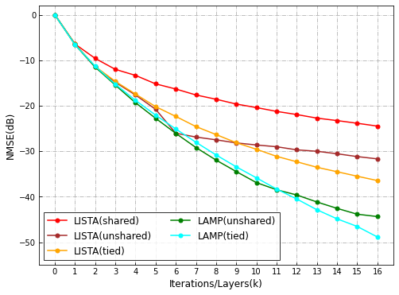

#### V1-2:

### V2

> verification of adding Nesterov's acceleration, LISTA(tied), LISTA-CP, ALISTA,and proposed LsLISTA; (-NA means Nesterov's acceleration is added)

- V2-1, LISTA(tied), LISTA(tied)-NA, LISTA-CP, LISTA-CP-NA, ALISTA, ALISTA-NA, LsLISTA, LsLISTA-NA, SNR=inf
- V2-2, LISTA(tied), LISTA(tied)-NA, LISTA-CP, LISTA-CP-NA, ALISTA, ALISTA-NA, LsLISTA, LsLISTA-NA, SNR=20

### results:

#### V2-1:

#### V1-2:

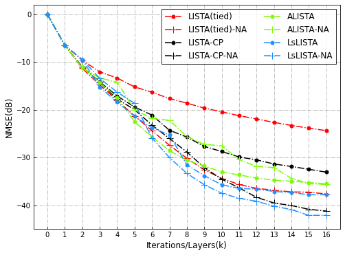

### V3

> validation of gamma, which is the learnable parameter for LMFISTA:

-  LM-LISTA-CP, LM-ALISTA, LM-FISTA, LM-LISTA-CPss, LM-ALISTA-ss, LM-FISTA-ss, r'$\frac{t_{(k)}-1}{t_{(k+1)}}$

### results:

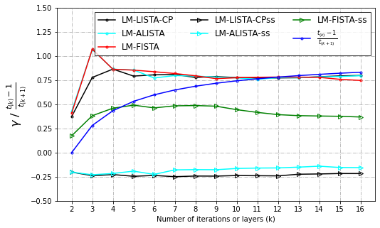

### V4

> comparison between traditional iterative algorithms and proposed unrolled algorithms:

- V4-1, ISTA, FISTA, TsLISTA, LsLISTA, LMFISTA SNR=inf
- V4-2, ISTA, FISTA, TsLISTA, LsLISTA, LMFISTA SNR=20
- V4-3, ISTA, FISTA, TsLISTA, LsLISTA, LMFISTA SNR=10

### results:

#### V4-1:

#### V4-2:

#### V4-3:

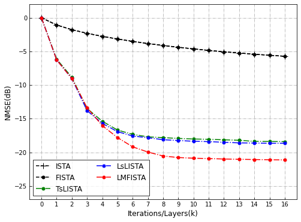

### V5

> comparison between benchmark algorithm LISTA(tied),  LAMP(tied), and proposed unrolled algorithms:

- V5-1, LISTA(tied), LAMP(tied), TsLISTA, LsLISTA, LMFISTA SNR=inf
- V5-2, LISTA(tied), LAMP(tied), TsLISTA, LsLISTA, LMFISTA SNR=20
- V5-3, LISTA(tied), LAMP(tied), TsLISTA, LsLISTA, LMFISTA SNR=10

### results:

#### V5-1:

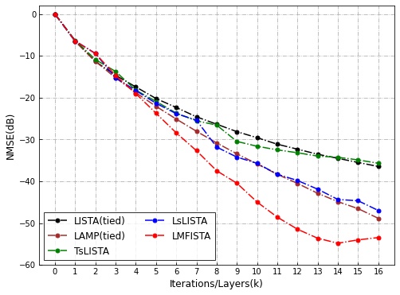

#### V5-2:

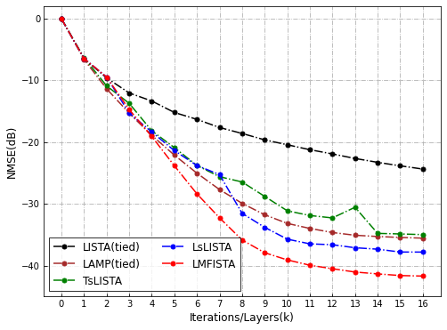

#### V5-3:

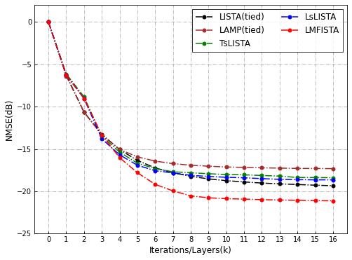

### V6

> comparison between weight coupling & analytical weight and proposed unrolled algorithms:

- V6-1, LISTA-CP, TiLISTA, ALISTA, TsLISTA, LsLISTA, LMFISTA SNR=inf
- V6-2, LISTA-CP, TiLISTA, ALISTA, TsLISTA, LsLISTA, LMFISTA SNR=20
- V6-3, LISTA-CP-ss, TiLISTA-ss, ALISTA-ss, LsLISTA-ss, LMFISTA-ss SNR=inf
- V6-4, LISTA-CP-ss, TiLISTA-ss, ALISTA-ss, LsLISTA-ss, LMFISTA-ss SNR=20

### results:

#### V6-1:

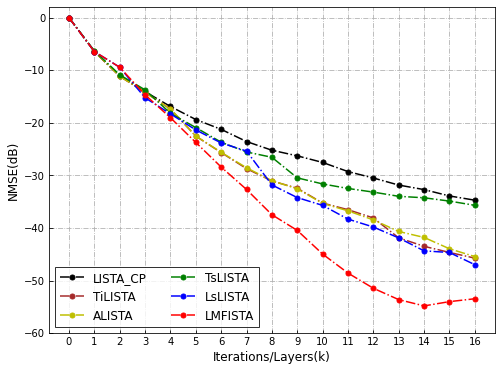

#### V6-2:

#### V6-3:

#### V6-4:

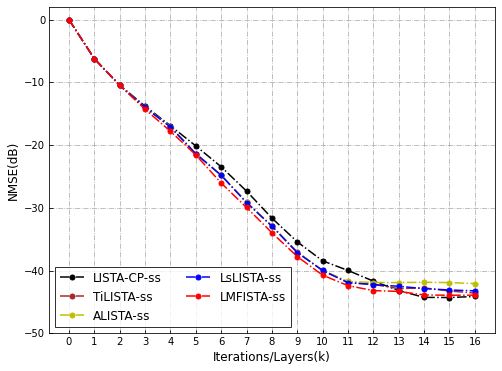

### V7

> comparison between accelerations or gain added and proposed LMFISTA:

- V7-1, LFISTA, GLISTA, LMFISTA, SNR=inf
- V7-2, LFISTA, GLISTA, LMFISTA, SNR=20

### results:

#### V7-1:

#### V7-2:

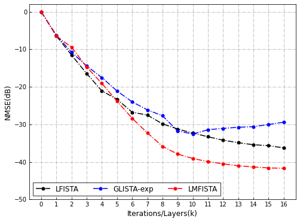

### V8

> comparison between having learned momentum added and without:

- V8-1, LISTA-CP, LM-LISTA-CP, ALISTA, LM-ALISTA, LsLISTA, LMFISTA, SNR=inf
- V8-1, LISTA-CP, LM-LISTA-CP, ALISTA, LM-ALISTA, LsLISTA, LMFISTA, SNR=20
- V8-1, LISTA-CP, LM-LISTA-CP, ALISTA, LM-ALISTA, LsLISTA, LMFISTA, SNR=10

### results:

#### V8-1:

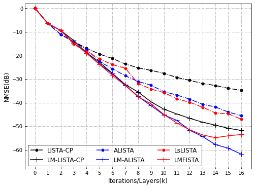

#### V8-2:

#### V8-3:

